# How the pipeline works

> Flow of the AI Weekly Podcast pipeline. Source: `README.md`, `pipeline/`.

```mermaid
flowchart TB
    START([Start: python -m pipeline run<br/><small>--date YYYY-MM-DD optional</small>]) --> COLLECT

    subgraph collect[Stage 1 — collect · writes data/collect.json]
        direction TB
        COLLECT[collect.collect<br/><small>date = today · sources = HN + arXiv</small>] --> HN[<b>Hacker News</b><br/><small>Algolia /search<br/>tags=story · points&gt;100 · 7d window<br/>upper date bound = target date</small>]
        COLLECT --> ARXIV[<b>arXiv</b><br/><small>Atom API cat:cs.AI<br/>submittedDate range query · 7d window<br/>5s sleep between pages</small>]
        HN --> HNDEDUP[HN dedup<br/><small>by objectID + normalized URL<br/>keep highest points · order preserved</small>]
        HNDEDUP --> HNGATE[<b>HN relevance gate</b><br/><small>100 titles/chunk -> relevant indices<br/>audience: AI researchers at a company</small>]
        HNGATE --> FETCH[<b>Body fetch</b><br/><small>trafilatura main-text extraction<br/>per surviving URL · 1MB cap · 8000-char limit<br/>empty -> title-only fallback</small>]
        ARXIV --> AXGATE[<b>arXiv relevance gate</b><br/><small>20 abstracts/chunk · recall-leaning<br/>RELEVANCE_MODEL · temperature=0</small>]
        AXGATE --> DEDUP[Dedup HN vs arXiv<br/><small>O&#40;n&#41; arXiv-ID hash join<br/>drop HN twin, keep paper abstract</small>]
        FETCH --> DEDUP
        DEDUP --> COLLECTJSON[/data/collect.json<br/><small>list of Item: title, url, date, body, source</small>/]
    end

    COLLECTJSON --> RANK

    subgraph rank[Stage 2 — rank · reads collect.json · writes rank.json]
        direction TB
        RANK[<b>Unified rubric judge</b><br/><small>one source-agnostic rubric · pure importance<br/>major release ≈ must-study paper ≈ 0.85<br/>anchored bands: 0.9+ / 0.7-0.89 / 0.4-0.69 / &lt;0.4</small>] --> JUDGE[Batched judge<br/><small>BATCH_SIZE=25 · 4 workers · retry 3×</small>]
        JUDGE --> FINAL[final_score = score<br/><small>no personal pass · no blend</small>]
        FINAL --> SORT[Sort by final_score desc]
        SORT --> RANKJSON[/data/rank.json<br/><small>list of RankedItem: +score, judge_reason, final_score</small>/]
    end

    RANKJSON --> GEN

    subgraph generate[Stage 3 — generate · reads rank.json + profile.md · writes brief + manifest + mp3]
        direction TB
        GEN[<b>Source selection</b><br/><small>threshold >= 0.8 = must include<br/>pace controls floor/cap:<br/>deep_dive: 5-10 · brief: 10-20<br/>weak week -> pad to floor · strong week -> cut at cap</small>] --> BRIEF[Render podcast_brief.md<br/><small>source-grouped digest<br/>arXiv PDF links + HN story links<br/>score per item · body excerpt</small>]
        BRIEF --> ADDSRC[Add sources to NotebookLM<br/><small>arXiv -> PDF URL · HN -> story URL<br/>unfetchable hosts -> text fallback<br/>clear old sources · add brief as file</small>]
        ADDSRC --> INSTR[Build instructions string<br/><small>from profile.md:<br/>knowledge_level -> jargon hint<br/>pace -> depth vs breadth hint<br/>unnumbered item list -> thematic grouping<br/>fixed opening/transition/closing style</small>]
        INSTR --> AUDIO[Generate Audio Overview<br/><small>AudioFormat from profile.format<br/>AudioLength from profile.target_length<br/>instructions = soft steer</small>]
        AUDIO --> MP3[/data/episode.mp3/]
        BRIEF --> EPJ[/data/episode.json manifest/]
    end

    EPJ --> END([Podcast episode ready])
    MP3 --> END
```



## Stage contracts

| Stage | Input | Output |
|-------|-------|--------|
| `collect` | date (default: today) | `data/DD-MM-YYYY/collect.json` — every `Item`: title, url, date, body, source (`hn` or `arxiv`) |
| `rank` | collect.json | `data/DD-MM-YYYY/rank.json` — the **full** scored pool (sorted desc) with `score`, `judge_reason`, `final_score` |
| `generate` | rank.json + profile.md | `data/DD-MM-YYYY/podcast_brief.md` + `episode.json` manifest (+ `episode.mp3`) |

Each run writes all of its outputs into a folder named `data/DD-MM-YYYY/`
(local run date), so successive runs never overwrite each other. Running a
single stage in isolation reads from the most recent folder's previous-stage
file, or from a `--date`-specified folder.

## Source selection (`generate`)

Items with `final_score >= 0.8` are "must include". The `pace` field in
`profile.md` sets a floor and cap:

| pace | floor | cap | intent |
|------|-------|-----|--------|
| `deep_dive` | 5 | 10 | fewer items, each in depth |
| `brief` | 10 | 20 | more items, each briefly |

- **Weak week** (few items ≥ 0.8): pad with the next-highest-scored items down
  to the floor.
- **Strong week** (many items ≥ 0.8): cut at the cap, keeping the top-scored.
- **Typical week**: all items ≥ 0.8 qualify (within floor/cap).

## Profile (`profile.md`)

Style-only — no personal topic preference. The pipeline ranks purely by
general importance; the profile only controls narrative style.

| Field | Effect |
|-------|--------|
| `knowledge_level` | `researcher` skips basics; `undergrad` explains jargon first |
| `pace` | Soft instruction + source-set size (floor/cap above) |
| `format` | Hard NotebookLM knob (`AudioFormat`): deep_dive, brief, critique, debate |
| `target_length` | Hard NotebookLM knob (`AudioLength`): short, default, long |

The instructions string sent to NotebookLM embeds: the knowledge-level hint,
the pace hint, an unnumbered item list (group thematically), per-item
guidance (what/how/why, cross-reference arXiv+HN twins), and fixed
opening/transition/closing style text.

## CLI

```bash
# run all three stages
python -m pipeline run

# re-run a single stage from the previous stage's file
python -m pipeline run --only collect
python -m pipeline run --only rank
python -m pipeline run --only generate --no-audio

# target a specific date's data folder
python -m pipeline run --date 21-08-2026

# re-rank from a cached rank.json (fast iteration)
python -m pipeline run --only rank --from-cache data/21-08-2026/rank.json
```
