# How the pipeline works

> Flow of the AI Weekly Podcast pipeline. Source: `README.md`, `.scratch/personalization/spec.md`.

```mermaid
flowchart TB
    START([Start: python -m pipeline run]) --> COLLECT

    subgraph collect[Stage 1 — collect · writes data/collect.json]
        direction TB
        COLLECT[collect.start<br/><small>date = today · sources = HN + arXiv</small>] --> HN[<b>Hacker News</b><br/><small>Algolia /search<br/>tags=story · points&gt;100 · created_at_i&gt;7d window</small>]
        COLLECT --> ARXIV[<b>arXiv</b><br/><small>Atom API cat:cs.AI<br/>7-day window · latest version per ID</small>]
        HN --> HNDEDUP[HN dedup<br/><small>by objectID + normalized URL<br/>keep highest points · order preserved</small>]
        HNDEDUP --> HNGATE[<b>HN relevance gate</b><br/><small>100 titles/chunk -> relevant indices<br/>audience: AI researchers at a company</small>]
        HNGATE --> FETCH[<b>Body fetch</b><br/><small>trafilatura main-text extraction<br/>per surviving URL · 1MB cap · 8000-char limit<br/>empty -> title-only fallback</small>]
        ARXIV --> AXGATE[<b>arXiv relevance gate</b><br/><small>20 abstracts/chunk · recall-leaning<br/>RELEVANCE_MODEL · temperature=0</small>]
        AXGATE --> DEDUP[Dedup HN vs arXiv<br/><small>O&#40;n&#41; arXiv-ID hash join<br/>drop HN twin, keep paper abstract</small>]
        FETCH --> DEDUP
        DEDUP --> COLLECTJSON[/data/collect.json<br/><small>list of Item: title, url, date, body, source</small>/]
    end

    COLLECTJSON --> rank0

    subgraph rank[Stage 2 — rank · reads collect.json · writes data/rank.json]
        direction TB
        rank0[<b>Importance pass</b><br/><small>RUBRIC_MODE=unified · one source-agnostic rubric<br/>major release ≈ must-study paper ≈ 0.85<br/>anchored bands: 0.9+ / 0.7-0.89 / 0.4-0.69 / &lt;0.4</small>] --> JUDGE[Batched judge<br/><small>BATCH_SIZE=25 · 4 workers · retry 3×</small>]
        JUDGE --> SORT0[Sort by score desc<br/><small>full pool · no top-N slice</small>]
        SORT0 --> PERSONAL{<b>Personalization active?</b><br/><small>profile.md exists<br/>AND ALPHA &lt; 1.0</small>}
        PERSONAL -- no<br/><small>Phase 1 mode</small> --> SKIP[final_score = score]
        PERSONAL -- yes --> PROF[<b>Personal pass</b><br/><small>read profile.md + feedback_log.json<br/>PERSONAL_PROMPT · fixed · 0-1 match score<br/>anti_topics demote · feedback as weak prior</small>]
        PROF --> BLEND[Linear blend<br/><small>final = ALPHA·score + &#40;1-ALPHA&#41;·personal_score<br/>ALPHA env var · default 0.7</small>]
        SKIP --> SORT1[Sort by final_score desc]
        BLEND --> SORT1
        SORT1 --> RANKJSON[/data/rank.json<br/><small>list of RankedItem: +score, judge_reason, kind,<br/>personal_score, personal_reason, alpha, final_score</small>/]
    end

    RANKJSON --> cluster0

    subgraph cluster[Stage 3 — cluster · reads rank.json · writes data/cluster.json]
        direction TB
        cluster0[select_pool<br/><small>top-50 by final_score OR score-distribution knee<br/>floor MIN_POOL=25</small>] --> EMBED[<b>BGE embeddings</b><br/><small>BAAI/bge-small-en-v1.5 · local · offline<br/>SIM_THRESHOLD=0.82 · env-overridable</small>]
        EMBED --> MINILM[Greedy single-linkage merge<br/><small>cosine >= threshold -> same candidate cluster<br/>singletons stay as one-item topics</small>]
        MINILM --> LABEL[<b>Per-cluster LLM label</b><br/><small>1 call/cluster: title · why · primary_url<br/>LABEL_WORKERS=4 parallel · env-overridable</small>]
        LABEL --> MERGE[<b>Cross-cluster LLM merge</b><br/><small>1 call: same-event clusters only<br/>conservative — no theme-level merging</small>]
        MERGE --> CLUSTERJSON[/data/cluster.json<br/><small>list of Topic: id, title, why, primary_url,<br/>aggregate_score, members</small>/]
    end

    CLUSTERJSON --> plan0

    subgraph plan[Stage 4 — plan · reads cluster.json · writes data/episode_plan.json]
        direction TB
        plan0[<b>Budget fill</b><br/><small>per-topic est_minutes @ 150 wpm<br/>+ 0.75 min/extra member<br/>greedy-fill to 28-30 min · clamp 24-34</small>] --> OUTLINE[<b>Editorial + narrative outline</b><br/><small>1 LLM call: editorial_groups + hook + motif +<br/>segments + outro in one JSON response<br/>segments ordered by editorial group<br/>roles: release·method·incident·evaluation·industry·analysis·standalone</small>]
        OUTLINE --> PLANJSON[/data/episode_plan.json<br/><small>EpisodePlan: date, target_minutes, hook, motif,<br/>segments, outro, editorial_groups</small>/]
    end

    PLANJSON --> gen0

    subgraph generate[Stage 5 — generate · reads episode_plan.json + cluster.json · writes brief + manifest + mp3]
        direction TB
        gen0[Render brief<br/><small>topic-grouped digestible overview<br/>why-it-matters · est minutes · per-member links + PDFs<br/>signposts · transitions · motif · hook · outro</small>] --> BRIEF[Write podcast_brief.md]
        BRIEF --> EPJ[/data/podcast_brief.md + data/episode.json manifest/]
        BRIEF --> AUDIO[Add sources to NotebookLM<br/><small>arXiv -> PDF URL · HN -> story URL<br/>instructions built from plan: motif, per-topic allocation,<br/>signposts, pacing · clear old sources · add brief as file</small>]
        AUDIO --> SOURCES[Verify sources in notebook<br/><small>list title/url</small>]
        SOURCES --> GEN[Generate Audio Overview<br/><small>two-host · topic-grouped · narratively planned<br/>AudioFormat.DEEP_DIVE · AudioLength.DEFAULT</small>]
        GEN --> MP3[/data/episode.mp3/]
    end

    EPJ --> END([Podcast episode ready])
    MP3 --> END
```



## Stage contracts

| Stage | Input | Output |
|-------|-------|--------|
| `collect` | date (default: today) | `data/collect.json` — every `Item`: title, url, date, body, source (`hn` or `arxiv`) |
| `rank` | `data/collect.json` | `data/rank.json` — the **full** scored pool (sorted desc, no top-N slice) with `score`, `judge_reason`, `kind`, `personal_score`, `personal_reason`, `alpha`, `final_score` |
| `cluster` | `data/rank.json` | `data/cluster.json` — `Topic[]` from the top-50 pool (BGE groups + LLM labels/merges) |
| `plan` | `data/cluster.json` | `data/episode_plan.json` — budget fill + editorial meta-groups + narrative outline (one LLM call) |
| `generate` | `data/episode_plan.json` + `data/cluster.json` | `data/podcast_brief.md` + `data/episode.json` manifest (+ optional `data/episode.mp3`) |

Each run writes all of its outputs into a folder named `data/DD-MM-YYYY/`, so
successive runs never overwrite each other. Running a single stage in isolation
reads from the most recent folder's previous-stage file.

Each stage also writes a human-reviewable `<stage>_report.md` next to its JSON
(arXiv gate pass-rate, rubric A/B comparison, personalization A/B comparison,
cluster table, merge diff, budget fill, editorial groups, narrative outline).

## Phase 2: personalization + fast iteration

The rank stage runs a **personal-match pass** alongside the importance rubric,
blending the two with a tunable `ALPHA` weight:

```
final_score = ALPHA · importance + (1 - ALPHA) · personal_match
```

- **`profile.md`** (repo root) — the listener's topics, anti-topics, and a
  free-text "what I'm working on" body. The only content the listener tunes;
  the personal-match prompt is fixed (no prompt-chasing).
- **`feedback_log.json`** (repo root) — binary kept/skipped marks per top-N
  item, recency-weighted (last 4 runs). Updated via
  `python -m pipeline mark <url> kept|skipped`.
- **`ALPHA`** env var — blend weight, default 0.7. `ALPHA=1.0` = pure importance
  (Phase 1 behaviour); `ALPHA=0.0` = pure personal (sanity test).

Fast iteration during tuning (skip collect + importance):

```bash
# Cache the importance pass once, then iterate the personal pass + blend:
python -m pipeline run --only rank \
  --from-cache data/21-08-2026/rank_unified.json \
  --ab-personal

# A/B report (primary tuning digest):
# data/<run>/rank_report.md — plain vs. personal arms, per-item which-surfaced-it
```

## Inspection reports (quality gates)

Each stage writes a human-reviewable report next to its JSON:

| Report | Stage | What it shows |
|--------|-------|---------------|
| `collect_report.md` | collect | arXiv gate pass-rate + 5 kept / 5 dropped samples |
| `rank_report.md` | rank | personalization A/B: plain vs. personal arms, per-item imp/pers/final, surfaced/demoted |
| `cluster_report.md` | cluster | topic table with pure-paper / pure-HN / mixed flags + cross-referencing metric |
| `merge_report.md` | cluster | before/after the cross-cluster LLM merge pass |
| `budget_report.md` | plan | score distribution with knee marked + fill-order table |
| `plan_report.md` | plan | editorial meta-groups + role distribution + hook + segments + outro |

Rendering note: each stage is a self-contained cluster (`collect`, `rank`,
`cluster`, `plan`, `generate`) reading/writing only `data/` files, so any stage
can be re-run in isolation via `--only collect|rank|cluster|plan|generate` or
skipped with `--no-audio`.
