# How the AI Weekly Podcast pipeline works

> Flow of the on-demand weekly podcast pipeline. Source: `README.md`,
> `pipeline-app/pipeline/`, `podcast-engine/podcast_engine/`.

The weekly pipeline lives in `pipeline-app/pipeline/` (run as
`python -m pipeline run`, from the CLI or via the FastAPI UI's job queue).
It shares the generic `podcast_engine` library (in `podcast-engine/`) with the
standalone MCP server in `mcp-app/`, which calls the same engine directly on
ad-hoc sources and is out of scope below. Every stage writes into the app's
own `pipeline-app/data/history/DD-MM-YYYY-HHMMSS/` run folder — never a shared
root `data/`.

```mermaid
flowchart TB
    START([Start: run the pipeline<br/><small>CLI: python -m pipeline run …<br/>UI: FastAPI job queue &#40;:8000&#41; → same subprocess</small>]) --> COLLECT

    subgraph collect[Stage 1 — collect · writes collect.json]
        direction TB
        COLLECT[collect.collect<br/><small>&#91;par 2&#93; HN + arXiv branches run in parallel<br/>window = 7d default / saved window_days<br/>or --window-start / --window-end<br/>a failed branch ⇒ episode just omits that source</small>] --> HN
        COLLECT --> ARX

        HN[<b>Hacker News</b><br/><small>Algolia /search · tags=story<br/>points&gt;100 · start..end+1 day window</small>] --> HNDEDUP[HN dedup<br/><small>by objectID + normalized URL<br/>keep highest points · order preserved</small>]
        HNDEDUP --> HNGATE[HN relevance gate<br/><small>&#91;batch 100 + par 4&#93; Mistral-Small<br/>titles/chunk · recall-leaning</small>]
        HNGATE --> FETCH[Body fetch<br/><small>&#91;par 8&#93; trafilatura main-text<br/>1MB cap · 8000-char body<br/>empty body ⇒ dropped at collect</small>]

        ARX[<b>arXiv cs.AI</b><br/><small>prefer OAI mirror, else query API</small>] --> MIRROR[<b>OAI metadata mirror</b><br/><small>&#91;cache&#93; oaipmh.arxiv.org · set cs:cs:AI<br/>lazy sync · 56d backfill on demand</small>]
        MIRROR --> WINDOW[window filter<br/><small>primary cs.AI · first-submitted in window<br/>drop withdrawn</small>]
        MIRROR -. "mirror empty / failed" .-> QUERY[fallback: query API<br/><small>&#91;stream&#93; submittedDate range query · 5s/page<br/>fetch + judge overlap · 429 backoff · 3 retries</small>]
        QUERY --> WINDOW
        WINDOW --> ARXGATE[arXiv coarse title gate<br/><small>&#91;stream + par 8&#93; Mistral-Small<br/>batches judged as pages arrive · 100 titles/chunk<br/>recall-leaning</small>]

        FETCH --> DEDUP[Cross-source dedup<br/><small>rule table &#40;winner=arxiv, dropper=hn, key=arxiv-id&#41;<br/>drop HN twin of a collected paper<br/>fold its hn_points onto the winner</small>]
        ARXGATE --> DEDUP
        DEDUP --> COLLECTJSON[/collect.json<br/><small>Item: title, url, date, body, source,<br/>gate_score, hn_points</small>/]
    end

    COLLECTJSON --> RANK

    subgraph rank[Stage 2 — rank · reads collect.json · writes rank.json]
        direction TB
        RANK[<b>Unified judge</b><br/><small>Qwen3.8-27B on SkaiNet<br/>one source-agnostic rubric<br/>single pass ⇒ score + reason + 1-3 topic labels<br/>~18-bucket taxonomy · salience-weighted</small>] --> JUDGE[Batched judge<br/><small>&#91;batch 25 + par 8&#93; · retry 3×<br/>full body per item · scores the whole post-gate pool</small>]
        JUDGE --> STEER[Steering<br/><small>no profile ⇒ final = importance<br/>else personal = cosine&#40;item_topics, profile&#41;<br/>final = &#40;1-α&#41;·importance + α·personal</small>]
        STEER --> SORT[Sort by final_score desc]
        SORT --> RANKJSON[/rank.json<br/><small>RankedItem: +score, judge_reason, topics,<br/>personal_score, final_score</small>/]
    end

    RANKJSON --> GEN

    subgraph generate[Stage 3 — generate · reads rank.json · writes the episode]
        direction TB
        GEN[<b>Source selection</b><br/><small>top-N by final_score above floor 0.5<br/>N from length/depth word budget &#40;4..30&#41;<br/>--brief-in ⇒ user-curated re-render</small>] --> BRIEF[Render podcast_brief.md<br/><small>source-grouped digest · arXiv PDF + HN links<br/>score · topic labels · body excerpt</small>]
        BRIEF --> EPJ[/episode.json manifest + config.yaml/]
        BRIEF --> MEMRITE[Write episode artifacts<br/><small>labels.json topic vector<br/>memory.json per-topic summary &#40;for NEXT episode&#41;</small>]
        MEMRITE --> CTX0[Build memory_context<br/><small>prior runs within mem_windows × window<br/>topic-matched · strict direct continuation only</small>]

        CTX0 --> ENGINE[<b>Shared podcast engine</b><br/><small>podcast_engine · also powers the MCP app</small>]
        ENGINE --> PFETCH[Fetch sources into per-run cache<br/><small>&#91;cache&#93; arXiv → full PDF &#40;10k head + 3k tail&#41;<br/>HN/web → page text &#40;22k&#41;</small>]
        PFETCH --> HEALTH[Check TNG qwen3 TTS health<br/><small>&#91;ovl&#93; warmed up before the transcript so TTS keeps up</small>]
        HEALTH --> TRANS[Two-host transcript<br/><small>&#91;ovl&#93; DeepSeek on SkaiNet · per-part word budget<br/>each part → TTS as it completes · retry ±20% · writes transcript.md</small>]
        TRANS --> AUDIO[Per-part voice-cloned TTS<br/><small>&#91;par 4/part&#93; TNG qwen3 · concurrent with transcript<br/>part sanity check · pydub merge · ffmpeg</small>]
        AUDIO --> MP3[/episode.mp3/]
        TRANS --> CT[/transcript.md<br/><small>ground truth · transcribe stage = no-op</small>/]
        CTX0 -. "memory.json of prior episodes" .-> ENGINE
    end

    EPJ --> END([Podcast episode ready])
    MP3 --> END
    CT --> END
```



## Acceleration markers

Tags in the boxes denote the throughput strategies used to keep a run fast:

| Marker | Meaning |
|--------|---------|
| `[par N]` | **parallel pool** — `N` worker threads run independent fetches / LLM calls at once |
| `[batch N]` | **batching** — one LLM call scores a chunk of `N` items |
| `[stream]` | **streaming** — work is judged incrementally as inputs arrive, overlapping producer wait with downstream processing |
| `[ovl]` | **phase overlap** — an independent phase (TTS warm-up / per-part audio) runs while the transcript LLM is still working |
| `[cache]` | **cache** — persist results (arXiv mirror, per-run source/transcript cache) so a re-run reuses instead of recomputing |

Where they appear:

- `collect` — the HN and arXiv branches run as `[par 2]`; HN relevance-gate batches are `[batch 100 + par 4]`; the HN body fetch is `[par 8]`; both arXiv gates `[stream]` (batches judged as pages arrive) with `[par 8]`; the arXiv OAI mirror and the engine's per-run source cache are `[cache]`.
- `rank` — the judge runs as `[batch 25 + par 8]`.
- `generate` — the TTS health check is an `[ovl]` warm-up; per-part TTS is `[par 4/part]` and runs concurrently with the transcript LLM (`[ovl]`), the transcript is fingerprint-cached (`[cache]`).

## Stage contracts

| Stage | Input | Output |
|-------|-------|--------|
| `collect` | window end (default: today / saved config) | `.../DD-MM-YYYY-HHMMSS/collect.json` — every `Item`: title, url, date, body, source (`hn`/`arxiv`), `gate_score`, `hn_points` |
| `rank` | collect.json | same folder `rank.json` — the **full** scored+labeled pool (sorted by `final_score` desc): `score`, `judge_reason`, `topics`, `personal_score`, `final_score` |
| `generate` | rank.json | same folder: `podcast_brief.md` + `episode.json` manifest + `episode.mp3` + `transcript.md` + `labels.json` + `memory.json` + `config.yaml` |
| `transcribe` | `episode.json` + `episode.mp3` | `transcript.md` — a **no-op** when the backend already wrote the ground-truth transcript |
| `label` | `episode.json` manifest | `labels.json` + brief `· topic` annotation — offline backfill for pre-steering episodes |

Each fresh run writes a unique time-stamped folder
`pipeline-app/data/history/DD-MM-YYYY-HHMMSS/` (from the UI or a bare CLI run),
so successive runs never overwrite each other — generating twice in one day
keeps both episodes. A single-stage re-run reads the most recent folder, or the
folder named by `--date` (ISO `YYYY-MM-DD`, `DD-MM-YYYY`, or a run id
`DD-MM-YYYY-HHMMSS`).

## Source selection + steering

The `generate` stage picks the aired set from `rank.json`:

- **Target N** is derived from the run config's word budget — total
  (length) minus the intro/recap slice, divided by per-source words (depth) —
  clamped to 4–30 sources (`config.RunConfig.budget()`).
- It takes the **top-N by `final_score` above `MIN_SCORE_FLOOR = 0.5`**. If
  fewer than N clear the floor it airs fewer (never pads with junk).
- **Steering** (`rank`): `final_score = (1-α)·importance + α·cosine(item_topics, profile)`.
  With no topics configured the blend is a no-op (pure importance order);
  α = 0 disables steering entirely. All labels are salience-weighted (primary
  facet 1.0, then 0.6, 0.35), so a paper that is both `post_training` and
  `agents` matches a profile interested in either.
- `--brief-in` re-renders from an edited brief: the manifest is reconstructed
  by URL-matching the brief's bullets against `rank.json`
  (`selection_source: "customized"`).
- The aired items' labels also publish the per-episode `labels.json` topic
  vector (used for history filtering), and the topic tokens stay visible in
  the brief as `· topic_a,topic_b` per bullet.

The small-model `gate_score` from collect travels through `collect.json` and
`rank.json` but is **not** used to prefilter the judge's input — the rank
judge scores the whole post-gate pool. The `generate` stage only surfaces it
as a forward monitor (min/median/max `gate_score` of the aired items) to flag
gate/judge misalignment.

Within a run, the backend auto-reuses the cached `transcript.md` when its
**fingerprint** (sources + config + memory, saved to
`.podcastfy-cache/transcript.fingerprint`) is unchanged, skipping the source
fetch and the LLM call; only a changed fingerprint (new selection, edited
brief, different memory) re-runs transcript generation. There is no CLI flag
to inject a foreign transcript — reuse is always fingerprint-gated.

## Cross-episode memory

Each episode's `generate` writes a per-topic `memory.json` summary (one small
LLM call over the aired manifest, with a deterministic digest fallback). The
**next** episode builds a `memory_context` from prior runs whose window-end
falls within `mem_windows × window_days` (default 2) of the current window-end,
matched to the current items' topic labels, and injects it into the transcript
LLM. References are strict-only: a part may acknowledge a prior item only for a
genuine continuation of the exact same story — never a same-topic-different-story
bridge and never a fabricated "last episode". Deleting an episode deletes its
folder and therefore its memory.

## Source fault-tolerance

Source branches run in parallel and are per-source resilient: a branch that
fails (e.g. arXiv throttled with HTTP 429) is dropped with a warning and the
run continues, producing an episode that simply omits that source. arXiv's
**OAI metadata mirror** (`arxiv_oai.py`) is the primary path — a sanctioned
bulk-metadata sync (`oaipmh.arxiv.org`, not throttled like the query API) kept
under `data/arxiv_mirror/` and deepened lazily; the query API is only a
fallback when the mirror fails or has nothing for the window. `collect` only
aborts when **no** source yields any item (it refuses to write an empty
`collect.json`). HN items whose body fetch returns empty are dropped at
collect so they never reach rank.

## CLI

```bash
# run all three stages (fresh pipeline-app/data/history/DD-MM-YYYY-HHMMSS/ folder)
python -m pipeline run

# re-run a single stage from the latest run folder (or --date <run-id>)
python -m pipeline run --only collect
python -m pipeline run --only rank
python -m pipeline run --only generate --no-audio
python -m pipeline run --only generate --date 21-08-2026-140557

# re-rank from a cached rank.json (fast iteration)
python -m pipeline run --only rank --from-cache data/history/21-08-2026-140557/rank.json

# re-render from an edited brief
python -m pipeline run --only generate --brief-in data/history/21-08-2026-140557/podcast_brief.md

# backfill topic labels for pre-steering episodes
python -m pipeline run --only label --force-label --date 21-08-2026

# user-facing knobs: defaults < config file < saved podcast_config.yaml < flags
python -m pipeline run --audience intermediate --familiar LLMs \
    --topics agents,post_training --steering-alpha 0.3 \
    --length long --depth brief --mem-windows 3
```

Episode generation happens in the browser (or via the pipeline CLI as a
dev/ops interface and for the maintenance tools: label backfill, taxonomy
refresh, evals, memory tests). Outputs of every stage land in one
time-stamped history folder, so an episode title is the same
`DD-MM-YYYY HH:MM` regardless of entry point.
