# How the pipeline works

> Flow of the AI Weekly Podcast pipeline. Source: `README.md`, `pipeline/`.

```mermaid
flowchart TB
    START([Start: python -m pipeline run<br/><small>--date YYYY-MM-DD optional</small>]) --> COLLECT

    subgraph collect[Stage 1 — collect · writes data/collect.json]
        direction TB
        COLLECT[collect.collect<br/><small>date = today · sources = HN + arXiv</small>] --> HN[<b>Hacker News</b><br/><small>Algolia /search<br/>tags=story · points&gt;100 · 7d window<br/>upper date bound = target date</small>]
        COLLECT --> ARXIV[<b>arXiv</b><br/><small>Atom API cat:cs.AI<br/>submittedDate range query · 7d window<br/>5s sleep between pages</small>]
        HN --> HNDEDUP[HN dedup<br/><small>by objectID + normalized URL<br/>keep highest points · order preserved</small>]
        HNDEDUP --> HNGATE[<b>HN relevance gate</b><br/><small>100 titles/chunk -> relevant indices<br/>audience: AI researchers at a company</small>]
        HNGATE --> FETCH[<b>Body fetch</b><br/><small>trafilatura main-text extraction<br/>per surviving URL · 1MB cap · 8000-char limit<br/>empty -> title-only fallback</small>]
        ARXIV --> AXGATE[<b>arXiv relevance gate</b><br/><small>20 abstracts/chunk · recall-leaning<br/>RELEVANCE_MODEL · temperature=0</small>]
        AXGATE --> DEDUP[Dedup HN vs arXiv<br/><small>O&#40;n&#41; arXiv-ID hash join<br/>drop HN twin, keep paper abstract</small>]
        FETCH --> DEDUP
        DEDUP --> COLLECTJSON[/data/collect.json<br/><small>list of Item: title, url, date, body, source</small>/]
    end

    COLLECTJSON --> RANK

    subgraph rank[Stage 2 — rank · reads collect.json · writes rank.json]
        direction TB
        RANK[<b>Unified rubric judge</b><br/><small>one source-agnostic rubric · pure importance<br/>major release ≈ must-study paper ≈ 0.85<br/>anchored bands: 0.9+ / 0.7-0.89 / 0.4-0.69 / &lt;0.4</small>] --> JUDGE[Batched judge<br/><small>BATCH_SIZE=25 · 4 workers · retry 3×</small>]
        JUDGE --> SCORE[Score<br/><small>no personalization · no blend</small>]
        SCORE --> SORT[Sort by score desc]
        SORT --> RANKJSON[/data/rank.json<br/><small>list of RankedItem: +score, judge_reason</small>/]
    end

    RANKJSON --> GEN

    subgraph generate[Stage 3 — generate · reads rank.json · writes brief + manifest + mp3 + transcript]
        direction TB
        GEN[<b>Source selection</b><br/><small>threshold &gt;= 0.8 = must include<br/>fixed floor=10 · cap=20<br/>weak week -&gt; pad to 10<br/>strong week -&gt; cut at 20</small>] --> BRIEF[Render podcast_brief.md<br/><small>source-grouped digest · researcher audience<br/>arXiv PDF links + HN story links<br/>score per item · body excerpt</small>]
        BRIEF --> PFETCH[Fetch sources into per-run cache<br/><small>arXiv -&gt; full PDF &#40;10k head + 3k tail&#41;<br/>HN/web -&gt; page text &#40;22k&#41;<br/>transcript_in -&gt; reuse cached transcript, skip LLM</small>]
        PFETCH --> TRANS[Generate two-host transcript<br/><small>DeepSeek on SkaiNet gateway<br/>reuses SKAINET_API_KEY<br/>writes data/transcript.md</small>]
        TRANS --> HEALTH[Check TNG qwen3 TTS health]
        HEALTH --> AUDIO[Synthesize voice-cloned audio<br/><small>TNG qwen3 TTS · pydub MP3 encode<br/>needs ffmpeg on PATH</small>]
        AUDIO --> MP3[/data/episode.mp3/]
        BRIEF --> EPJ[/data/episode.json manifest/]
        TRANS --> TRANSCRIPT[/data/transcript.md<br/><small>ground-truth · transcribe stage is a no-op</small>/]
    end

    EPJ --> END([Podcast episode ready])
    MP3 --> END
```



## Stage contracts

| Stage | Input | Output |
|-------|-------|--------|
| `collect` | date (default: today) | `data/DD-MM-YYYY/collect.json` — every `Item`: title, url, date, body, source (`hn` or `arxiv`) |
| `rank` | collect.json | `data/DD-MM-YYYY/rank.json` — the **full** scored pool (sorted desc) with `score`, `judge_reason` |
| `generate` | rank.json | `data/DD-MM-YYYY/podcast_brief.md` + `episode.json` manifest + `episode.mp3` + `transcript.md` |

Each run writes all of its outputs into a folder named `data/DD-MM-YYYY/`
(local run date), so successive runs never overwrite each other. Running a
single stage in isolation reads from the most recent folder's previous-stage
file, or from a `--date`-specified folder.

## Source selection (`generate`)

Items with `score >= 0.8` are "must include", with a fixed floor of 10 and cap
of 20:

| week shape | rule | result |
|------|-------|-----|
| weak (few items ≥ 0.8) | pad | next-highest-scored items down to 10 |
| strong (many items ≥ 0.8) | cap | cut at 20, keeping the top-scored |
| typical | threshold | all items ≥ 0.8 (within 10–20) |

There is no personalization — every listener gets the same ranking and the same
selection.

## CLI

```bash
# run all three stages
python -m pipeline run

# re-run a single stage from the previous stage's file
python -m pipeline run --only collect
python -m pipeline run --only rank
python -m pipeline run --only generate --no-audio

# target a specific date's data folder
python -m pipeline run --date 21-08-2026

# re-rank from a cached rank.json (fast iteration)
python -m pipeline run --only rank --from-cache data/21-08-2026/rank.json

# regenerate audio from a cached transcript (skip the LLM step)
python -m pipeline run --only generate --transcript-in data/31-08-2026/transcript.md
```
